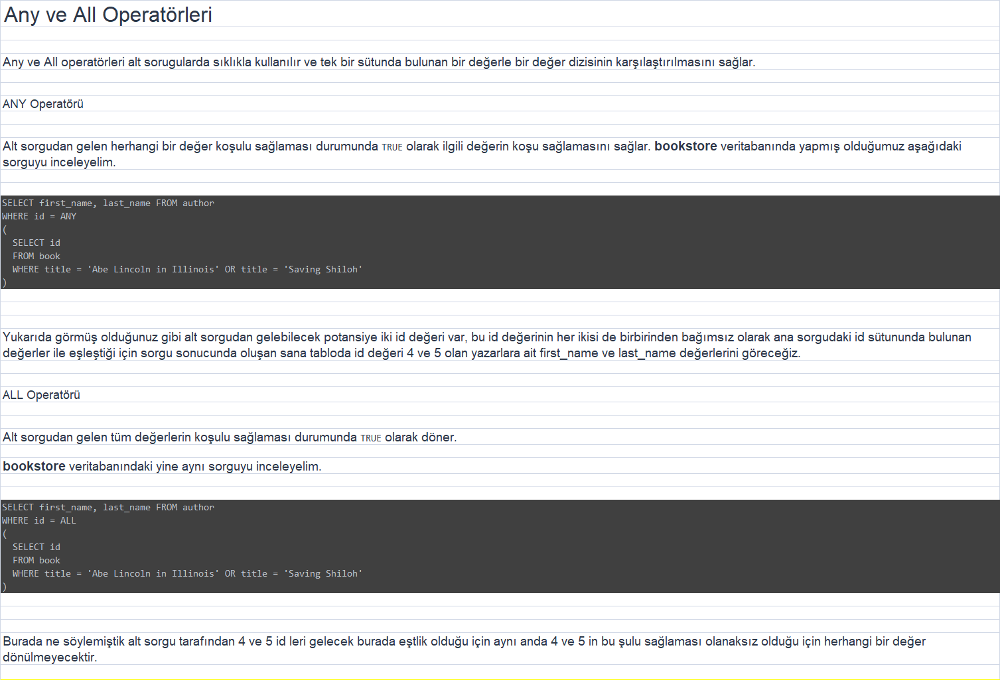
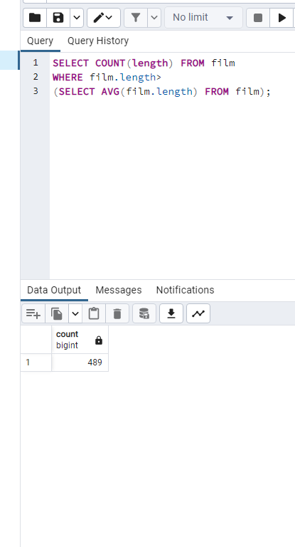
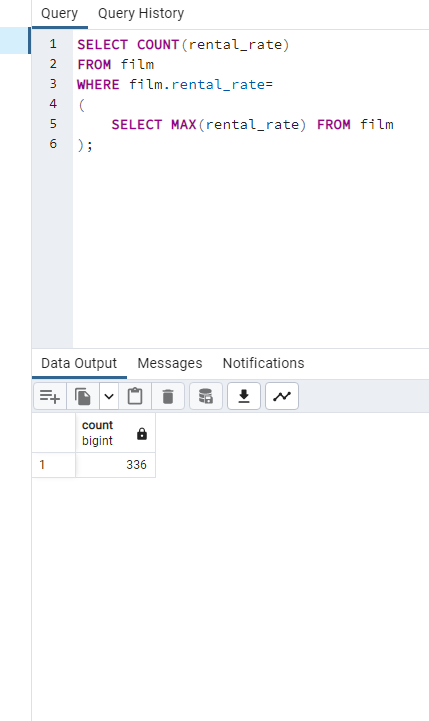
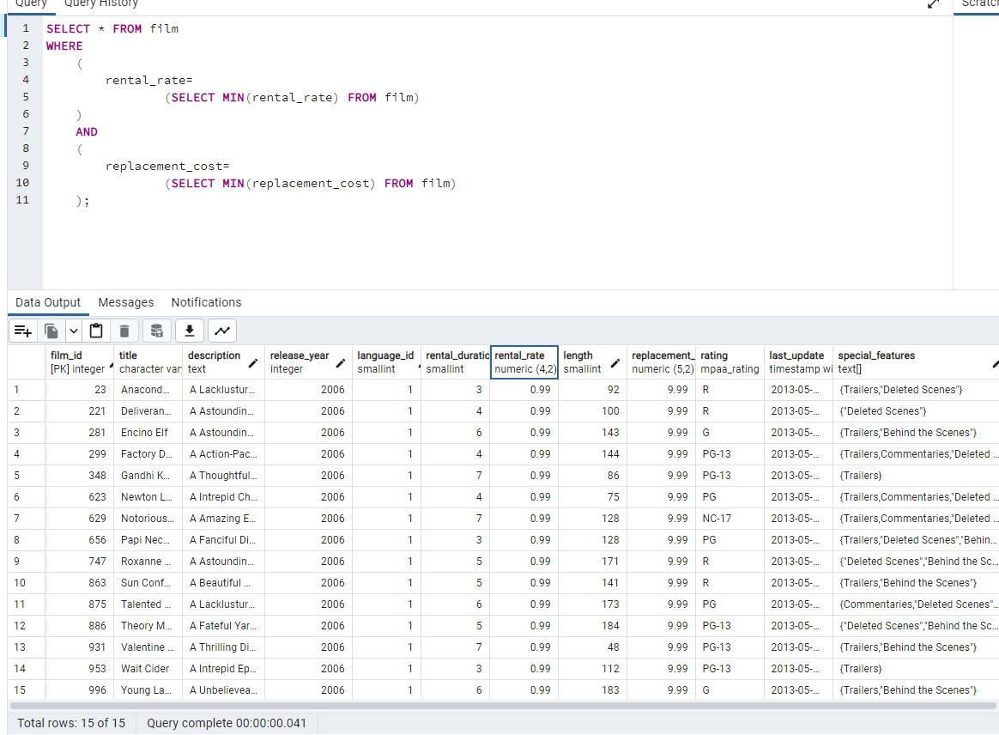
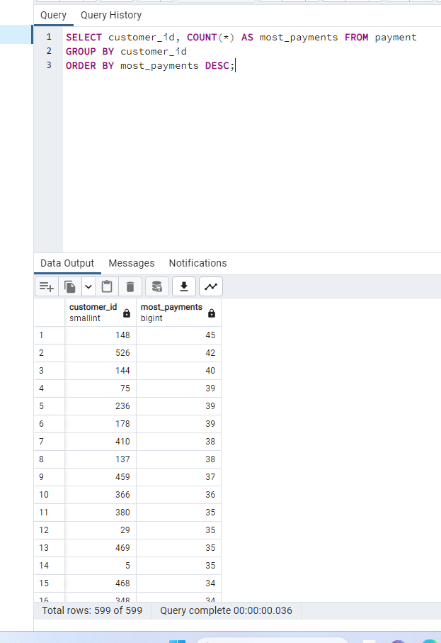

Aşağıdaki sorgu senaryolarını dvdrental örnek veri tabanı üzerinden gerçekleştiriniz.

film tablosunda film uzunluğu length sütununda gösterilmektedir. Uzunluğu ortalama film uzunluğundan fazla kaç tane film vardır?

---

film tablosunda en yüksek rental_rate değerine sahip kaç tane film vardır?

---

film tablosunda en düşük rental_rate ve en düşün replacement_cost değerlerine sahip filmleri sıralayınız.

---
payment tablosunda en fazla sayıda alışveriş yapan müşterileri(customer) sıralayınız.

---